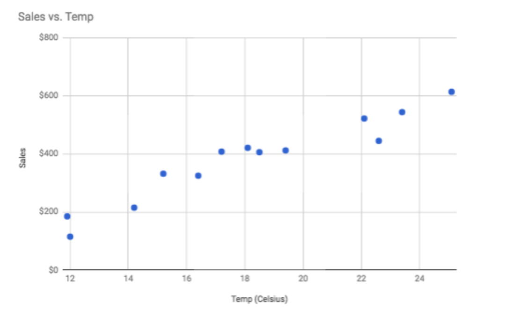
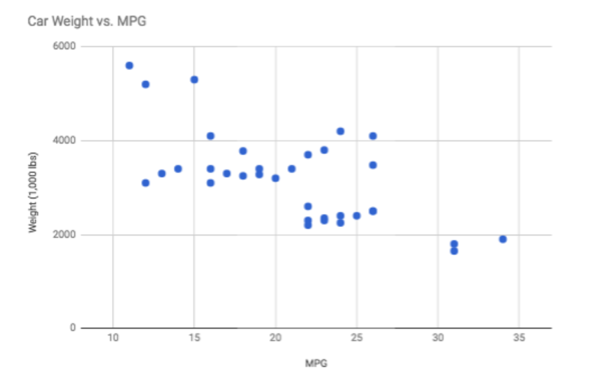
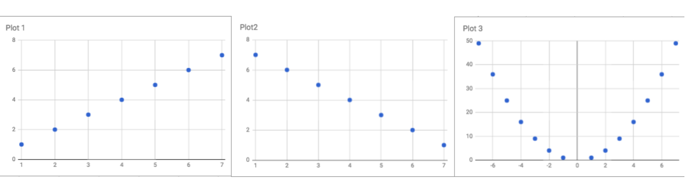

#### Why do we use Data Visualizations?

Creating good data visualizations combines two skills:
 - design and artistic component
 - scientific and mathemathical component in being able to deliver the right insights

#### Motivation for Data Visualization

 Summary Statistics vs. Visualizations
Summary statistics like the mean and standard deviation can be great for attempting to quickly understand aspects of a dataset, but they can also be misleading if you make too many assumptions about how the data distribution looks.

It is important to pick out visual patterns, trends and outliers during analysis as relying on only summara statistics can be misleading. 

#### Anscome's Quartet

[Anscome's Quartet](https://en.wikipedia.org/wiki/Anscombe%27s_quartet) developed by F.J. Anscombe in 1973, Anscombe's Quartet is a set of four datasets, where each produces the same summary statistics (mean, standard deviation, and correlation), which could lead one to believe the datasets are quite similar. However, after visualizing (plotting) the data, it becomes clear that the datasets are markedly different.

[More about Anscome's Quartet](https://www.autodeskresearch.com/publications/samestats)

#### Identiying Data Types

Doctor Visits per Year => **Ordinal** - categorical values that are ranked (like scale from Very positive to Very negative).

Life Expectancy => **Continuous** - quantitative values that can be split into smaller values.

Spending per Person => **Continuous**

Has Universal Healthcare => **Categorical** data types are used to label a group or set of items (zip code, marital status, letter grades, rating on a survey( Poor, Og, Great), gender, breakfast type).

#### Univariate Plots

If interested in an one column analysis it's called the **univarite** analysis where **uni**stands for one. For univarite analysis both continuous and descrete, the most common plot to visualize the data is a **histogram** also can use Box-and-Whisker plot,  Stem-and-Leaf plot or a Normal Quantile Plot. 

For one **quantitative** variable data the most common plot is histogram. 

For univarite **categorical** the most common plot is a bar chart. A bar chart is like a histogram but the bins are determined based on a set category and not based on a range thet the chart creator can change.

For **ordinal categorical** variable it makes more sense to use a bar chart. 

For quantitative data, if we are just looking at one column worth of data, we have four common visuals:

- Histogram
- Normal Quantile Plot
- Stem and Leaf Plot
- Box and Whisker Plot

In most cases, you will want to use a histogram.

For categorical data, if we are looking at just one variable (column), we have three common visuals:

- Bar Chart
- Pie Chart
- Pareto Chart

In most cases, you will want to use a bar chart.

#### Scatter Plots

When compare 2 **quantative** variables to one another (like heights and weights) the most common plot is the scatter plot. This plot can be used to visialize both the strength and the direstion of the relationship between the two variables.  A common summary statistic that relates to a scatter plot is the **correlation coefficient** commonly denoted by **r**.

Though there are a [few different ways](https://www.statisticssolutions.com/correlation-pearson-kendall-spearman/) to measure correlation between two variables, the most common way is with Pearson's correlation coefficient. [Pearson's correlation coefficient](https://en.wikipedia.org/wiki/Pearson_correlation_coefficient) provides the of a linear relationship:

1. Strength
2. Direction => when both variables increase is Positive Direction and Strength Strong
		     => when one variable increases the other variable decreases is Negative Direction and Strength Moderate
		     => As the points become more spread out from one another is Negative Direction and Strength Weak

[Spearman's Correlation](https://en.wikipedia.org/wiki/Spearman%27s_rank_correlation_coefficient) Coefficient does not measure linear relationships specifically, and it might be more appropriate for certain cases of associating two variables.

**Correlation Coefficient**  - the Strength and Direction of a linear relationship. Used to tell the Strength and the Direction of a linear relationship. The **correlation coefficient**is always between -1 and 1 where the closer it is to 1 or -1 the **stronger the relationship**.

#### Quizes

Strength - Strong
Direction - Positive
Correlation Coefficient - Close to 1 

Strength - Moderate 
Direction - Negative(Indirect)
Correlation Coefficient - -0.67

Plot 1 Correlation Coefficient: 1.0
Plot 1 Correlation Coefficient: -1.0
Plot 1 Correlation Coefficient: 0