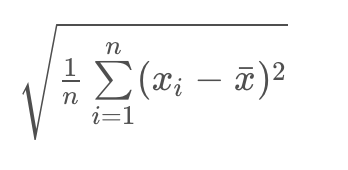

## Descriptive Statistics Part 2

#### Measures of Spread

**Measures of Spread** mean how far are points from one another or how spread out our data are from one another. Common measures of spread include:

1. Range
2. Interquartile Range (IQR)
3. Standard Deviation
4. Variance

#### Histogram

Histogram the most common visual for quantitative data. 

Histogram and bins:

#### Introduction to Five Number Summary

Five Number Summary consist of:

1. **Minimum**: The smallest number in the dataset.
2. **Q1**: The value such that 25% of the data fall below.
3. **Q2** or MEDIAN: The value such that 50% of the data fall below.
4. **Q4**: The value such that 75% of the data fall below.
5. **Maximum**: The largest value in the dataset.

Example:

1, 2, 3, 3, 5, 8, 10

Min = 1
Q1 = 2
Q2(Median) = 3
Q3 = 8
Max = 10
Range = Max - Min = 9
IQR = Q3 - Q1 = 6

Example an even set of values:

1, 2, 3, 3, 5, 8, 10, 105
In order to find Q1 and Q3, we divide our dataset between the two values we use to find the median:

`1, 2, 3, 3`  Q1 = 2, 3 = 2.5
`5, 8, 10, 105` Q3 = 8, 10 = 9

min = 1
Q1 = 2.5
Q2(Median) = (3+5)/2 = 4
Q3 = 9
max = 105
Range = 104

**Range**
The **range** is then calculated as the difference between the maximum and the minimum.

**IQR**
The interquartile range is calculated as the difference between **Q3** and **Q1**.

#### Box Plot

Box Plot can be useful for quickly comparing the spread of two data sets across some keq metrics like quartiles, max and min.

For datasets that are **not symmetric**, the five number summary and a corresponding box-plot are a great way to get started with understanding the spread of your data.

#### Standard Deviation and Variance

**Standard Deviation** defined as the average distance of each observation from the mean.

#### Standard Deviation Calculation

1. Take an average of the sample or x-bar.
2. Deviation from the mean: xi -x-bar
3. Square each deviation
4. Variance is the average squared deviations
5. Standard deviations is simply the square root of the variance.

Two additional measures of spread that are used all the time are the variance and standard deviation.

#### Recap Standard Deviation and Variance

- Standard Deviations is used to compare spread of different groups to determine which is more spread out.

- When data pertains to money or the economy, having higher standerd deviation is associated with having higher risk.

- In comparing stock prices, a stock price that changes with higher standard deviation over time is considered more risky than a stock price that fluctuates with lower standard deviation. 

- Fair comparisons requaire the same units.

- Variance has squared units of the original dataset. The variance is used to compare the spread of two different groups. A set of data with higher variance is more spread out than a dataset with lower variance. Be careful though, there might just be an outlier (or outliers) that is increasing the variance, when most of the data are actually very close.

- Standard Deviation is the square root of the variance and shares units with the original dataset.

- If standard Deviation is a zero value, that is mean all of data points are the same value.

#### Shape