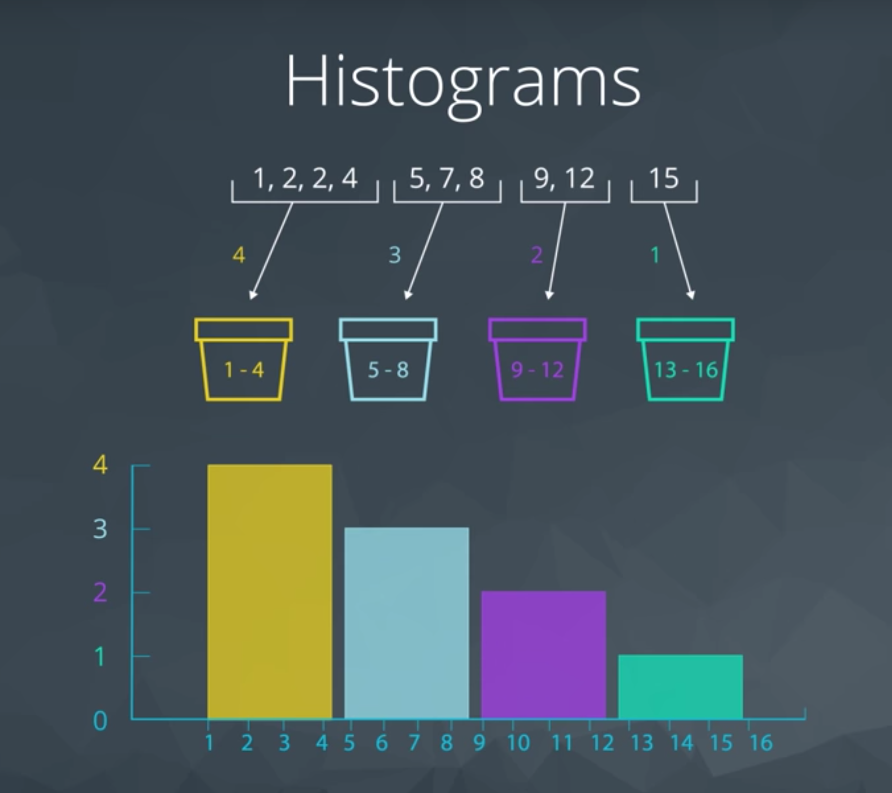

## Descriptive Statistics Part 2

#### Measures of Spread

**Measures of Spread** mean how far are points from one another or how spread out our data are from one another. Common measures of spread include:

1. Range
2. Interquartile Range (IQR)
3. Standard Deviation
4. Variance

#### Histogram

Histogram the most common visual for quantitative data. 

Histogram and bins:

#### Introduction to Five Number Summary

Five Number Summary consist of:

1. **Minimum**: The smallest number in the dataset.
2. **Q1**: The value such that 25% of the data fall below.
3. **Q2** or MEDIAN: The value such that 50% of the data fall below.
4. **Q4**: The value such that 75% of the data fall below.
5. **Maximum**: The largest value in the dataset.

Example:

1, 2, 3, 3, 5, 8, 10

Min = 1
Q1 = 2
Q2(Median) = 3
Q3 = 8
Max = 10
Range = Max - Min = 9
IQR = Q3 - Q1 = 6

Example an even set of values:

1, 2, 3, 3, 5, 8, 10, 105
In order to find Q1 and Q3, we divide our dataset between the two values we use to find the median:

`1, 2, 3, 3`  Q1 = 2, 3 = 2.5
`5, 8, 10, 105` Q3 = 8, 10 = 9

min = 1
Q1 = 2.5
Q2(Median) = (3+5)/2 = 4
Q3 = 9
max = 105
Range = 104

**Range**
The **range** is then calculated as the difference between the maximum and the minimum.

**IQR**
The interquartile range is calculated as the difference between **Q3** and **Q1**.